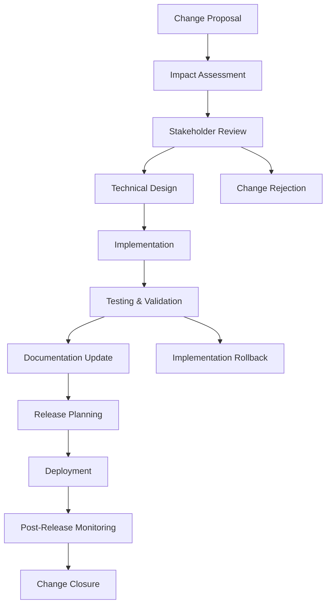
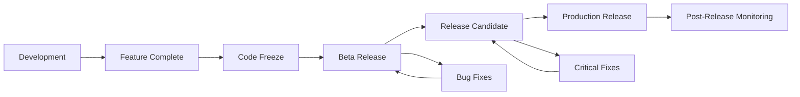

# LangGraph Product Requirements Document (PRD)

## Document Information

- **Version:** 1.0.0
- **Last Updated:** 2024-12-19
- **Document Owner:** LangGraph Product Team
- **Review Cycle:** Quarterly
- **Status:** Active

---

## Table of Contents

1. [Product Overview](#product-overview)
2. [Change Management Framework](#change-management-framework)
3. [History Tracking System](#history-tracking-system)
4. [Stakeholder Roles & Responsibilities](#stakeholder-roles--responsibilities)
5. [Release Management Process](#release-management-process)
6. [Documentation Standards](#documentation-standards)
7. [Quality Assurance Framework](#quality-assurance-framework)
8. [Communication Plan](#communication-plan)
9. [Appendices](#appendices)

---

## Product Overview

### Vision Statement
LangGraph is the definitive low-level orchestration framework for building, managing, and deploying long-running, stateful agents that can operate reliably in production environments.

### Mission
To provide developers with the foundational infrastructure needed to create sophisticated agent systems that persist through failures, incorporate human oversight, maintain comprehensive memory, and scale confidently in production.

### Core Value Propositions

1. **Durable Execution**: Build agents that persist through failures and automatically resume from exact points of interruption
2. **Human-in-the-Loop**: Seamless integration of human oversight with inspection and modification capabilities
3. **Comprehensive Memory**: Stateful agents with both short-term working memory and long-term persistent memory
4. **Production-Ready Deployment**: Scalable infrastructure designed for stateful, long-running workflows
5. **Developer Experience**: Low-level control without abstraction of prompts or architecture

### Target Audience

- **Primary**: Senior developers and ML engineers building production agent systems
- **Secondary**: AI researchers prototyping complex agent workflows
- **Tertiary**: DevOps engineers deploying and maintaining agent infrastructure

### Success Metrics

- **Adoption**: Number of active projects using LangGraph
- **Reliability**: Agent uptime and failure recovery rates
- **Performance**: Agent execution speed and resource efficiency
- **Developer Satisfaction**: Community feedback and contribution rates
- **Ecosystem Growth**: Number of integrations and extensions

---

## Change Management Framework

### Philosophy

LangGraph's change management framework is inspired by its own core concepts of **persistence**, **checkpoints**, and **state history**. Just as LangGraph agents maintain state across time, our product development maintains a clear audit trail of decisions, changes, and their impacts.

### Change Categories

#### 1. **Critical Changes** (Requires Full Committee Review)
- Breaking API changes
- Architecture modifications affecting core framework
- Security-related changes
- New major features or components

#### 2. **Standard Changes** (Requires Technical Review)
- New non-breaking features
- Performance improvements
- Documentation updates
- Bug fixes affecting multiple components

#### 3. **Minor Changes** (Requires Peer Review)
- Bug fixes for specific components
- Code quality improvements
- Test additions
- Minor documentation corrections

### Change Lifecycle



### Change States

| State | Description | Required Actions |
|-------|-------------|------------------|
| **Proposed** | Initial change request submitted | Impact assessment, stakeholder identification |
| **Under Review** | Technical and business review in progress | Stakeholder feedback, design refinement |
| **Approved** | Change approved for implementation | Technical design completion, resource allocation |
| **In Development** | Implementation in progress | Code development, testing, documentation |
| **Testing** | Validation and quality assurance | Test execution, performance validation |
| **Ready for Release** | Change ready for deployment | Release planning, deployment preparation |
| **Released** | Change deployed to production | Monitoring, user communication |
| **Closed** | Change successfully implemented | Post-implementation review, lessons learned |
| **Rejected** | Change not approved | Documentation of rejection rationale |
| **Rolled Back** | Change reverted due to issues | Root cause analysis, remediation planning |

### Change Request Template

```markdown
## Change Request: [Title]

### Basic Information
- **Change ID**: [Unique identifier]
- **Submitted By**: [Name and role]
- **Date Submitted**: [YYYY-MM-DD]
- **Priority**: [Critical/High/Medium/Low]
- **Category**: [Critical/Standard/Minor]

### Description
[Detailed description of the proposed change]

### Business Justification
[Why this change is needed, business value, user impact]

### Technical Impact Assessment
- **Components Affected**: [List of affected modules/libraries]
- **Breaking Changes**: [Yes/No - if yes, describe]
- **Dependencies**: [External dependencies or prerequisites]
- **Performance Impact**: [Expected performance implications]
- **Security Considerations**: [Any security implications]

### Implementation Plan
- **Estimated Effort**: [Development time estimation]
- **Required Resources**: [Team members, tools, infrastructure]
- **Timeline**: [Key milestones and deadlines]
- **Testing Strategy**: [How the change will be validated]

### Risk Assessment
- **Technical Risks**: [Potential technical challenges]
- **Business Risks**: [Potential business impact if things go wrong]
- **Mitigation Strategies**: [How risks will be addressed]

### Rollback Plan
[How to revert the change if needed]

### Success Criteria
[How success will be measured]
```

### Approval Workflows

#### Critical Changes
1. **Proposal Review** (Product Owner + Tech Lead)
2. **Architecture Review** (Architecture Committee)
3. **Security Review** (Security Team - if applicable)
4. **Business Review** (Stakeholder Committee)
5. **Final Approval** (Product Owner + CTO)

#### Standard Changes
1. **Technical Review** (Component Maintainer + Tech Lead)
2. **Impact Review** (Affected Team Leads)
3. **Approval** (Product Owner)

#### Minor Changes
1. **Peer Review** (2+ Team Members)
2. **Approval** (Component Maintainer)

---

## History Tracking System

### Versioning Strategy

LangGraph follows **Semantic Versioning (SemVer)** with the following conventions:

- **MAJOR.MINOR.PATCH** (e.g., 2.1.0)
  - **MAJOR**: Breaking changes that require user action
  - **MINOR**: New features that are backward compatible
  - **PATCH**: Bug fixes and minor improvements

### Change History Documentation

#### 1. **Checkpoint System**
Each significant change creates a "checkpoint" in our development history:

```yaml
checkpoint:
  id: "CHG-2024-001"
  timestamp: "2024-12-19T10:30:00Z"
  version: "0.6.1"
  type: "feature"
  summary: "Added support for async checkpointers"
  components_affected:
    - "langgraph/checkpointers"
    - "langgraph/core"
  breaking_changes: false
  migration_guide: "docs/migration/v0.6.1.md"
  rollback_procedure: "docs/rollback/v0.6.1.md"
```

#### 2. **State History Tracking**
Maintains a comprehensive record of product evolution:

```json
{
  "state_history": [
    {
      "state_id": "v0.6.1",
      "timestamp": "2024-12-19T10:30:00Z",
      "changes": [
        {
          "change_id": "CHG-2024-001",
          "type": "feature",
          "description": "Added async checkpointer support",
          "author": "jane.doe@company.com",
          "reviewer": "john.smith@company.com",
          "tests_added": ["test_async_checkpointer.py"],
          "documentation_updated": ["docs/checkpointers.md"],
          "performance_impact": "+2% memory, -5% latency"
        }
      ],
      "validation_results": {
        "tests_passed": 1247,
        "tests_failed": 0,
        "coverage": "94.2%",
        "performance_benchmarks": "passed"
      }
    }
  ]
}
```

#### 3. **Decision Registry**
Documents architectural and product decisions:

```markdown
# Decision Record: DR-2024-012

## Title
Adoption of Async Checkpointer Pattern

## Status
Accepted

## Context
Users need better performance for long-running agents with frequent state saves.

## Decision
Implement async checkpointer interface to improve I/O performance.

## Consequences
- **Positive**: 40% improvement in checkpoint save/load times
- **Negative**: Increased complexity in error handling
- **Risks**: Potential race conditions in concurrent scenarios

## Alternatives Considered
1. Thread-based parallelization (rejected: GIL limitations)
2. Batch checkpointing (rejected: memory overhead)

## Implementation
- Timeline: 2 weeks
- Components: core, checkpointers
- Breaking changes: None (backward compatible)
```

### Audit Trail Requirements

#### Change Tracking
- **Who**: User ID and role of person making change
- **What**: Detailed description of change made
- **When**: Timestamp with timezone
- **Where**: Specific components/files affected
- **Why**: Reference to original change request/issue
- **How**: Implementation approach and technical details

#### Approval Tracking
- **Approval Chain**: Complete record of who approved what and when
- **Review Comments**: All feedback and discussion threads
- **Conditions**: Any conditions or requirements attached to approval
- **Authority Level**: Level of authority exercised for approval

#### Implementation Tracking
- **Development Progress**: Milestones and completion status
- **Code Changes**: Git commits, pull requests, and merges
- **Testing Results**: Test execution results and coverage reports
- **Documentation Updates**: Documentation changes and reviews

---

## Stakeholder Roles & Responsibilities

### Product Development Committee

#### Product Owner
- **Primary Responsibility**: Overall product vision and roadmap
- **Change Management Role**: Final approval for all changes
- **Authority Level**: Can approve/reject any change
- **Reporting**: Monthly product health reports

#### Technical Lead / Architect
- **Primary Responsibility**: Technical architecture and design decisions
- **Change Management Role**: Technical review and architectural approval
- **Authority Level**: Veto power on technical implementations
- **Reporting**: Architecture review summaries

#### Component Maintainers
- **Primary Responsibility**: Specific component development and maintenance
- **Change Management Role**: Review changes affecting their components
- **Authority Level**: Approve minor changes, recommend major changes
- **Reporting**: Component health and change impact assessments

### Review Committees

#### Architecture Review Committee
- **Members**: Senior engineers, architects, external advisors
- **Responsibility**: Review architectural changes and ensure consistency
- **Meeting Frequency**: Bi-weekly or as needed for critical changes
- **Decision Authority**: Binding recommendations on architectural matters

#### Security Review Committee
- **Members**: Security engineers, external security consultants
- **Responsibility**: Review security implications of changes
- **Meeting Frequency**: As needed for security-related changes
- **Decision Authority**: Binding veto on security grounds

### User Representatives

#### Community Representatives
- **Role**: Represent user community interests
- **Responsibilities**: Provide user feedback, test beta features
- **Engagement**: Monthly feedback sessions, user surveys

#### Enterprise Users
- **Role**: Represent enterprise customer needs
- **Responsibilities**: Enterprise use case validation, performance requirements
- **Engagement**: Quarterly business reviews, direct feedback channels

### Development Teams

#### Core Framework Team
- **Responsibility**: Core LangGraph framework development
- **Size**: 6-8 developers
- **Focus Areas**: Persistence, execution engine, core APIs

#### Ecosystem Team
- **Responsibility**: Integrations, SDKs, and platform features
- **Size**: 4-6 developers
- **Focus Areas**: SDKs, integrations, deployment platform

#### Documentation Team
- **Responsibility**: Documentation, examples, and developer experience
- **Size**: 2-3 technical writers
- **Focus Areas**: User guides, API documentation, tutorials

---

## Release Management Process

### Release Types

#### 1. **Major Releases** (Quarterly)
- **Scope**: Significant new features, architectural changes
- **Planning Horizon**: 3-6 months
- **Change Freeze**: 2 weeks before release
- **Beta Period**: 4 weeks
- **Examples**: v1.0.0, v2.0.0

#### 2. **Minor Releases** (Monthly)
- **Scope**: New features, improvements, non-breaking changes
- **Planning Horizon**: 1-2 months
- **Change Freeze**: 1 week before release
- **Beta Period**: 1 week
- **Examples**: v1.1.0, v1.2.0

#### 3. **Patch Releases** (As Needed)
- **Scope**: Bug fixes, security patches, critical fixes
- **Planning Horizon**: 1-2 weeks
- **Change Freeze**: 3 days before release
- **Beta Period**: 3 days
- **Examples**: v1.1.1, v1.1.2

#### 4. **Hotfix Releases** (Emergency)
- **Scope**: Critical security issues, production-breaking bugs
- **Planning Horizon**: Hours to days
- **Change Freeze**: None (emergency process)
- **Beta Period**: Minimal testing in controlled environment
- **Examples**: v1.1.1-hotfix.1

### Release Pipeline



### Release Criteria

#### Feature Complete Criteria
- [ ] All planned features implemented and tested
- [ ] API documentation updated
- [ ] User documentation written
- [ ] Migration guides prepared (if needed)
- [ ] Performance benchmarks completed
- [ ] Security review completed (if applicable)

#### Code Freeze Criteria
- [ ] All code changes committed and reviewed
- [ ] Test suite passes with >95% coverage
- [ ] No open high-priority bugs
- [ ] Documentation review completed
- [ ] Release notes drafted

#### Beta Release Criteria
- [ ] Beta builds successfully created
- [ ] Automated tests passing
- [ ] Manual testing completed
- [ ] Beta documentation published
- [ ] Community notifications sent

#### Production Release Criteria
- [ ] Beta feedback incorporated
- [ ] All release blockers resolved
- [ ] Final testing completed
- [ ] Release artifacts signed and verified
- [ ] Rollback procedures tested
- [ ] Support team prepared

### Release Communication

#### Pre-Release (T-2 weeks)
- **Audience**: Development team, early adopters
- **Channels**: GitHub discussions, developer newsletter
- **Content**: Feature preview, breaking changes, migration guides

#### Release Day (T-0)
- **Audience**: All users
- **Channels**: Website, GitHub releases, social media, documentation
- **Content**: Release announcement, changelog, upgrade instructions

#### Post-Release (T+1 week)
- **Audience**: Community, enterprise users
- **Channels**: Blog posts, webinars, user forums
- **Content**: Feature deep-dives, best practices, troubleshooting

---

## Documentation Standards

### Documentation Types

#### 1. **Technical Documentation**
- **API Reference**: Auto-generated from code docstrings
- **Architecture Docs**: System design and component interactions
- **Developer Guides**: Implementation tutorials and best practices

#### 2. **User Documentation**
- **User Guides**: How-to guides for common use cases
- **Tutorials**: Step-by-step learning experiences
- **Conceptual Docs**: Explanations of core concepts

#### 3. **Process Documentation**
- **Change Management**: This PRD and associated processes
- **Release Notes**: Version-specific changes and improvements
- **Migration Guides**: Upgrade instructions and breaking changes

### Documentation Lifecycle

#### Creation Phase
1. **Requirements Gathering**: Identify documentation needs
2. **Content Planning**: Outline structure and key topics
3. **Draft Creation**: Write initial content
4. **Technical Review**: Accuracy and completeness check
5. **Editorial Review**: Style, clarity, and consistency
6. **Publication**: Release to appropriate channels

#### Maintenance Phase
1. **Regular Reviews**: Quarterly accuracy assessments
2. **User Feedback**: Incorporate user suggestions and corrections
3. **Version Updates**: Update for new releases and changes
4. **Deprecation Management**: Mark and remove outdated content

### Documentation Quality Standards

#### Technical Accuracy
- [ ] All code examples tested and working
- [ ] API documentation matches implementation
- [ ] Version compatibility clearly indicated
- [ ] Prerequisites and dependencies listed

#### Clarity and Usability
- [ ] Clear learning objectives stated
- [ ] Logical flow and organization
- [ ] Appropriate use of examples and diagrams
- [ ] Links to related content provided

#### Completeness
- [ ] All public APIs documented
- [ ] Error conditions and troubleshooting covered
- [ ] Performance considerations included
- [ ] Security implications addressed

### Documentation Templates

#### Change Documentation Template
```markdown
# Change Documentation: [Change Title]

## Overview
[Brief description of what changed]

## Impact
- **User Impact**: [How this affects end users]
- **Developer Impact**: [How this affects developers using LangGraph]
- **Breaking Changes**: [Any breaking changes]

## Migration Guide
[Step-by-step instructions for upgrading]

## Examples
[Code examples showing new functionality]

## Related Changes
[Links to related changes or documentation]
```

---

## Quality Assurance Framework

### Testing Strategy

#### 1. **Unit Testing**
- **Coverage Target**: >95% for all new code
- **Tools**: pytest, unittest
- **Frequency**: Every commit
- **Responsibility**: Developer implementing feature

#### 2. **Integration Testing**
- **Scope**: Component interactions and API contracts
- **Tools**: pytest with integration test fixtures
- **Frequency**: Every pull request
- **Responsibility**: Component maintainers

#### 3. **End-to-End Testing**
- **Scope**: Complete workflows and user scenarios
- **Tools**: Custom testing framework
- **Frequency**: Every release candidate
- **Responsibility**: QA team with product input

#### 4. **Performance Testing**
- **Metrics**: Memory usage, execution time, throughput
- **Tools**: pytest-benchmark, custom profiling
- **Frequency**: Major releases and performance-sensitive changes
- **Responsibility**: Performance engineering team

#### 5. **Security Testing**
- **Scope**: Vulnerability scanning, dependency checking
- **Tools**: bandit, safety, SAST scanners
- **Frequency**: Every release
- **Responsibility**: Security team

### Quality Gates

#### Pull Request Quality Gates
- [ ] All tests pass
- [ ] Code coverage maintains or improves
- [ ] No security vulnerabilities introduced
- [ ] Documentation updated (if applicable)
- [ ] Performance impact assessed
- [ ] Breaking changes justified and documented

#### Release Quality Gates
- [ ] All automated tests pass
- [ ] Manual testing completed
- [ ] Performance benchmarks met
- [ ] Security scan clean
- [ ] Documentation complete and accurate
- [ ] Migration testing successful (for breaking changes)

### Continuous Monitoring

#### Health Metrics
- **Test Success Rate**: Percentage of passing tests over time
- **Coverage Trends**: Code coverage changes by component
- **Performance Metrics**: Execution time and resource usage trends
- **Security Posture**: Vulnerability counts and resolution times

#### Quality Indicators
- **Bug Escape Rate**: Issues found in production vs. testing
- **Time to Resolution**: Average time from bug report to fix
- **Regression Rate**: Frequency of reintroduced bugs
- **User Satisfaction**: Community feedback and issue reports

---

## Communication Plan

### Internal Communication

#### Development Team
- **Daily Standups**: Progress updates and blocker resolution
- **Weekly Planning**: Sprint planning and priority alignment
- **Monthly Reviews**: Component health and technical debt assessment
- **Quarterly Planning**: Roadmap updates and resource allocation

#### Stakeholders
- **Monthly Product Updates**: Feature progress and roadmap changes
- **Quarterly Business Reviews**: Metrics, goals, and strategic updates
- **Ad-hoc Communications**: Critical issues and urgent decisions

### External Communication

#### Community
- **Release Announcements**: New versions and major features
- **Development Updates**: Monthly progress reports and upcoming features
- **Technical Blog Posts**: Deep dives into architecture and best practices
- **Community Forums**: Ongoing support and feedback collection

#### Enterprise Users
- **Quarterly Business Reviews**: Roadmap alignment and feedback
- **Early Access Programs**: Beta testing and feedback collection
- **Technical Advisory Calls**: Architecture discussions and requirements gathering

### Communication Channels

#### Primary Channels
- **GitHub**: Issues, discussions, releases, and code reviews
- **Documentation Site**: Official documentation and guides
- **Developer Newsletter**: Monthly updates and announcements
- **Community Forum**: User support and discussion

#### Secondary Channels
- **Social Media**: Release announcements and community highlights
- **Technical Blog**: In-depth articles and case studies
- **Webinars**: Feature demonstrations and Q&A sessions
- **Conferences**: Industry presentations and workshops

### Crisis Communication

#### Incident Response
1. **Initial Assessment** (0-30 minutes): Severity determination and stakeholder notification
2. **Status Updates** (Every 30 minutes): Progress reports to affected users
3. **Resolution Communication** (0-2 hours): Fix deployment and verification
4. **Post-Incident Review** (24-48 hours): Root cause analysis and prevention measures

#### Communication Templates

##### Security Incident
```markdown
# Security Advisory: [Issue Title]

## Severity: [Critical/High/Medium/Low]

## Summary
[Brief description of the security issue]

## Affected Versions
[List of affected versions]

## Impact
[Description of potential impact]

## Mitigation
[Immediate steps users should take]

## Fix
[Information about the fix and timeline]

## Credit
[Attribution to security researchers if applicable]
```

---

## Appendices

### Appendix A: Glossary

| Term | Definition |
|------|-------------|
| **Checkpoint** | A saved state of an agent at a specific point in execution |
| **State History** | Complete record of state changes over time |
| **Durability** | Ability to persist and recover from failures |
| **Thread** | Execution context for a specific agent instance |
| **Human-in-the-Loop** | Integration points for human oversight and intervention |
| **Change Request** | Formal proposal for product or system modification |
| **Release Candidate** | Pre-release version ready for final testing |
| **Rollback** | Process of reverting to a previous version or state |

### Appendix B: Change Request Form

[See Change Request Template in Change Management Framework section]

### Appendix C: Emergency Escalation Procedures

#### Severity Levels
- **P0 (Critical)**: Production down, security breach, data loss
- **P1 (High)**: Major functionality broken, significant user impact
- **P2 (Medium)**: Minor functionality issues, workaround available
- **P3 (Low)**: Cosmetic issues, nice-to-have improvements

#### Escalation Contacts
- **P0 Incidents**: On-call engineer → Engineering manager → CTO
- **P1 Incidents**: Component maintainer → Tech lead → Engineering manager
- **P2/P3 Incidents**: Standard development process

### Appendix D: Compliance and Audit Requirements

#### Change Tracking Requirements
- All changes must be traceable to original business requirement
- Approval records must be maintained for minimum 3 years
- Technical implementation details must be documented
- Post-implementation reviews must be completed within 30 days

#### Audit Trail Components
- Change initiation records
- Review and approval documentation
- Implementation evidence (commits, deployments)
- Validation results and sign-offs
- Post-implementation monitoring data

---

**Document End**

*This PRD is a living document that evolves with the LangGraph product. Regular reviews ensure it remains accurate and useful for all stakeholders.*